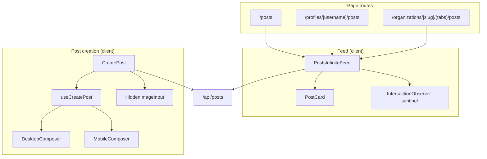
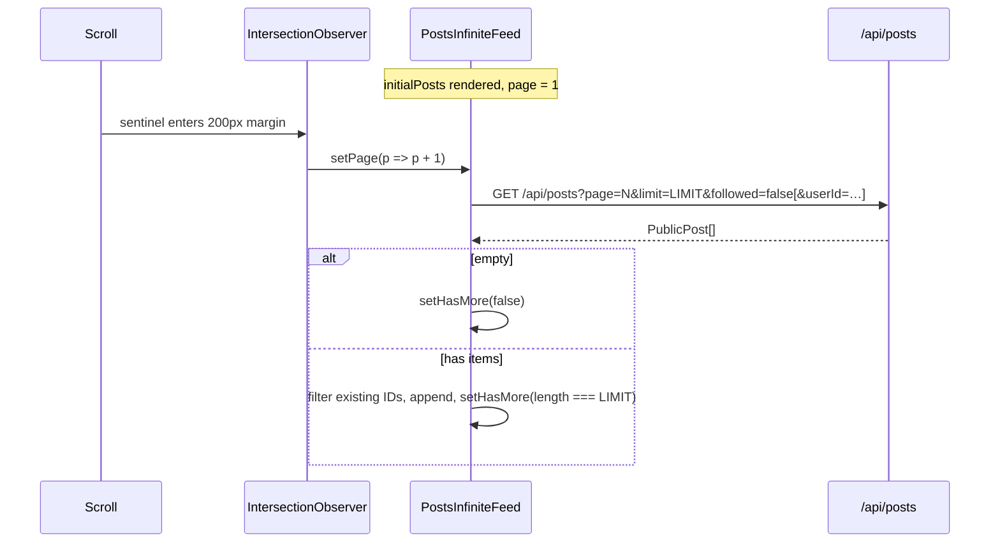

Posts are the core social publishing surface of Ozeaon. Users and organisations compose text-and-image posts, optionally embedding a quote-repost of an existing post. The feed renders them through a server-seeded infinite list that paginates client-side against `/api/posts`.

## Overview

The feature splits into two halves: the **feed** (`PostsInfiniteFeed`) and the **composer** (`CreatePost` + `useCreatePost`).

Three design decisions shape both:

- **Offset-based numeric pagination with client-side ID de-duplication.** The server API takes `page` and `limit`; the client filters out IDs it already holds, so a post inserted between two pages does not render twice.
- **Set-based interaction lookups.** `likedPosts` and `repostedPosts` are arrays from the server; the feed `useMemo`-ifies them as `Set`s for O(1) per-card resolution without re-allocating on every render.
- **Orchestrator + hook + shared parts composer.** `CreatePost` is a thin shell; `useCreatePost` owns all state. Both desktop and mobile layouts consume the same hook object, so behaviour cannot drift between breakpoints.

**Reposts** are quote-posts: `RepostButton` ([source](https://github.com/ozeaon/ozeaon-v2/blob/0a4f1a95824db87782f1221a4108019d174df3d9/src/components/posts/RepostButton.tsx)) calls `requestRepost`, which opens the composer pre-loaded with the original post. Submitting creates a new `posts` row with `post_tag` set to the original post's id; the count is stored in `post_stats.repost_count`. See [Post Images & Reposts](../post-attachments/) for the full data model.

**Followed feed** (`filterFollowed` prop) is dormant. The prop and the `followed` query parameter are wired in `PostsInfiniteFeed`, but no caller currently passes `filterFollowed: true` because the follow action is not available from the UI (connections and follows are roadmap).

**Bookmarks** are on the roadmap. `PostActions` renders a Bookmark button that is `sr-only` and `disabled`.

## Architecture

The server renders the first page and passes it as `initialPosts`; the client component owns pagination via an `IntersectionObserver` sentinel.

`PostsInfiniteFeed` is the single feed component. The three page routes pass different `userId` or `organizationId` scoping props rather than using separate implementations. `AccountPostsClient` (the account posts management view) is a separate component with its own card layout and does not use `PostsInfiniteFeed`. `OrgPostsFeed.tsx` exists but is not imported anywhere.

## The Feed

[`PostsInfiniteFeed`](https://github.com/ozeaon/ozeaon-v2/blob/0a4f1a95824db87782f1221a4108019d174df3d9/src/components/posts/PostsInfiniteFeed.tsx) is a client component that accepts `initialPosts`, `likedPosts`, `repostedPosts`, and optional `userId` / `organizationId` / `filterFollowed` props.

Key behaviors:

- **Initial `hasMore`** is `initialPosts.length === FEED_PAGE_LIMIT` (declared in [`src/config/constants/feeds.ts`](https://github.com/ozeaon/ozeaon-v2/blob/0a4f1a95824db87782f1221a4108019d174df3d9/src/config/constants/feeds.ts)). No total count is fetched from the server, so one extra empty request fires when the total is an exact multiple of the page size.
- **Two-effect observer pattern.** The first effect creates an `IntersectionObserver` on the sentinel and increments `page` on intersection. Guards (`!hasMore`, `!loading`) prevent re-creating the observer while a request is in flight. The second effect calls `fetchPage(page)` on page change, skipping page 1 (which arrived via SSR).
- **ID de-duplication** filters fetched posts against a `Set` of already-held IDs before appending, handling the offset-pagination window-shift problem.
- **Errors close the feed.** The catch block sets `hasMore = false`; `fetchWithRetry` has already exhausted retries by this point.
- **Reset on `router.refresh()`.** A `useEffect` on `initialPosts` resets `posts`, `page`, and `hasMore`. The `page === 1` guard in the fetch effect prevents a redundant network call.

The [`/api/posts` route](https://github.com/ozeaon/ozeaon-v2/blob/0a4f1a95824db87782f1221a4108019d174df3d9/src/app/api/posts/route.ts) handles `followed`, `userId`, and `organizationId` query parameters and returns `PublicPost[]`.

## The Composer

[`CreatePost`](https://github.com/ozeaon/ozeaon-v2/blob/0a4f1a95824db87782f1221a4108019d174df3d9/src/components/posts/create-form/CreatePostForm.tsx) returns `null` until hydrated and until `composer.user` is present, then selects `MobileComposer` or `DesktopComposer` based on `composer.isMobile`. `useCreatePost` owns all state — form, composer visibility, image lifecycle, submit flow — so neither layout holds any logic.

The key architectural detail: `HiddenImageInput` is constructed once by the orchestrator and passed down as a prop to whichever layout renders. There is exactly one live `<input type="file">` in the DOM at a time; both the in-form attached-image row and the mobile toolbar button trigger the same element via the shared ref.

The composer is mounted on the home feed through [`CreatePostFormSlot`](https://github.com/ozeaon/ozeaon-v2/blob/0a4f1a95824db87782f1221a4108019d174df3d9/src/components/home/CreatePostFormSlot.tsx).

`CustomPostFilters` is used on `/posts/custom` as the designated place for feed filter UI. Feed filters are in progress.

## Failure Modes & Edge Cases

- **Network failure.** `fetchWithRetry` exhausts its retries; the catch block sets `hasMore = false`. No retry affordance is shown; the already-loaded posts stay usable.
- **Page-size boundary.** If total posts is an exact multiple of `FEED_PAGE_LIMIT`, one extra empty request fires before `hasMore` flips `false`. This is bounded and harmless.
- **Concurrent inserts.** Offset pagination can shift the window and re-deliver a post. The ID de-dup set discards it silently.
- **Hydration mismatch.** `composer.isMobile` is viewport-derived. `useHydration()` suppresses the first composer render to prevent server/client markup mismatch; the composer appears after hydration.
- **`router.refresh()` resets pagination.** Previously loaded pages 2..N are discarded; they re-load as the user scrolls.

## Operational Notes

`FEED_PAGE_LIMIT` (in [`src/config/constants/feeds.ts`](https://github.com/ozeaon/ozeaon-v2/blob/0a4f1a95824db87782f1221a4108019d174df3d9/src/config/constants/feeds.ts)) is the single tuning knob — it governs both the initial `hasMore` heuristic and every request's `limit`. There is no per-surface override. The feed has no windowing or virtualisation: the DOM grows as the user scrolls.

## Extension Points

- **New feed scopes.** Add a scoping prop and a `params.set(...)` call in `fetchPage`. The `userId`/`organizationId` pair demonstrates the pattern.
- **Followed-feed activation.** Wire `filterFollowed` from a caller once connections/follows are rewired to the UI (roadmap).
- **Retry affordance.** Keep `hasMore = true` on error and expose an explicit retry; `fetchPage` is already a stable `useCallback` reference.
- **New composer controls.** Add to `create-form/parts/` and consume in both layouts; add any new state to `useCreatePost`, not to a layout.

## Related Links

- [`PostsInfiniteFeed.tsx`](https://github.com/ozeaon/ozeaon-v2/blob/0a4f1a95824db87782f1221a4108019d174df3d9/src/components/posts/PostsInfiniteFeed.tsx)
- [`CreatePostForm.tsx`](https://github.com/ozeaon/ozeaon-v2/blob/0a4f1a95824db87782f1221a4108019d174df3d9/src/components/posts/create-form/CreatePostForm.tsx)
- [`/api/posts` route](https://github.com/ozeaon/ozeaon-v2/blob/0a4f1a95824db87782f1221a4108019d174df3d9/src/app/api/posts/route.ts)
- [`src/config/constants/feeds.ts`](https://github.com/ozeaon/ozeaon-v2/blob/0a4f1a95824db87782f1221a4108019d174df3d9/src/config/constants/feeds.ts) — `FEED_PAGE_LIMIT`
- [`RepostButton.tsx`](https://github.com/ozeaon/ozeaon-v2/blob/0a4f1a95824db87782f1221a4108019d174df3d9/src/components/posts/RepostButton.tsx)
- [Post Images & Reposts](../post-attachments/)
- [Components: Posts](../../components/posts/)
