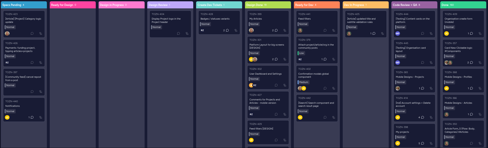

Work flows through 11 phases on the OZEAON Tasks board on Monday.

The board is split into two tracks. Columns 1 to 6 are the design track, run by BA, Designer, and PM. Columns 7 to 11 are the dev track, run by Engineering and QA.

## Design track

The spec comes first. BA and PM write it, and the designer designs against it.

1. Specs Pending - the entry point for a feature. BA and PM write the functional and logic spec, at feature level, for example "User Dashboard and Settings" or "Educational Resources".
2. Ready for Design - spec is written and the feature is upcoming next for designers.
3. Design in Progress - designer working in Figma against the spec. Design work often surfaces gaps or contradictions in the spec, which BA amends as they go.
4. Design Review - waiting for Joseph's signoff on visual direction.
5. Create Dev Tickets - designs are signed off and fully synced with the spec. The work that will actually be built is put into Ready for Dev from here. A broad design ticket is broken down into granular dev tickets; a narrow one that is already the size of a single piece of work moves across as it is.
6. Design Done - designs are frozen and the dev work exists on the board. Where the design ticket was broken down, it is closed as delivered here and goes no further.

## Dev track

7. Ready for Dev - developer ticket backlog, whether based on designs or not. This is where the dev tickets created in column 5 land, alongside any purely technical work.
8. Dev In Progress - developer building the ticket.
9. Code Review - PR is open and waiting on a reviewer.
10. QA - PR is approved and QA test it on the PR's own preview environment. See [Preview Environments](/ozeaon-wiki/process/preview-environments/).
11. Done - merged into main, which deploys to production.

Two rules govern the handover between columns 9, 10, and 11:

- **Review before QA.** Any change that comes out of review rebuilds the preview and voids a QA pass, so a ticket only enters QA once the PR is approved. Nothing goes to QA and review at the same time.
- **A QA failure moves the ticket back to Dev In Progress.** Not back to Code Review - the fix has to be built before it can be reviewed again, and a ticket parked in a column QA thinks they own is a ticket nobody picks up. It comes back up through Code Review as normal.

The assignee is whoever the ticket is waiting on - developer, then reviewer, then QA. The column already says which stage the work is at, so the assignee says who specifically is holding it.

## Statuses outside the flow

The board also carries Backlog, Stuck, Change Request, and Phase 2. These are not steps in the eleven, and a ticket sitting in one of them is waiting on a decision rather than on the next column. Move it back into the flow explicitly when the decision lands.

## Getting from design to dev

Column 5 is a judgement call between BA, PM, and a dev lead: is this ticket already one piece of work, or is it an area of the product?

"Update the icon in the article header" is one piece of work. It moves straight into Ready for Dev.

"User Dashboard and Settings" is an area, and needs breaking into granular tickets - "Add account deletion confirmation modal", "Wire up notification preferences form", "Persist theme choice per user". Each one links back to the parent design ticket so the original design context is traceable.
