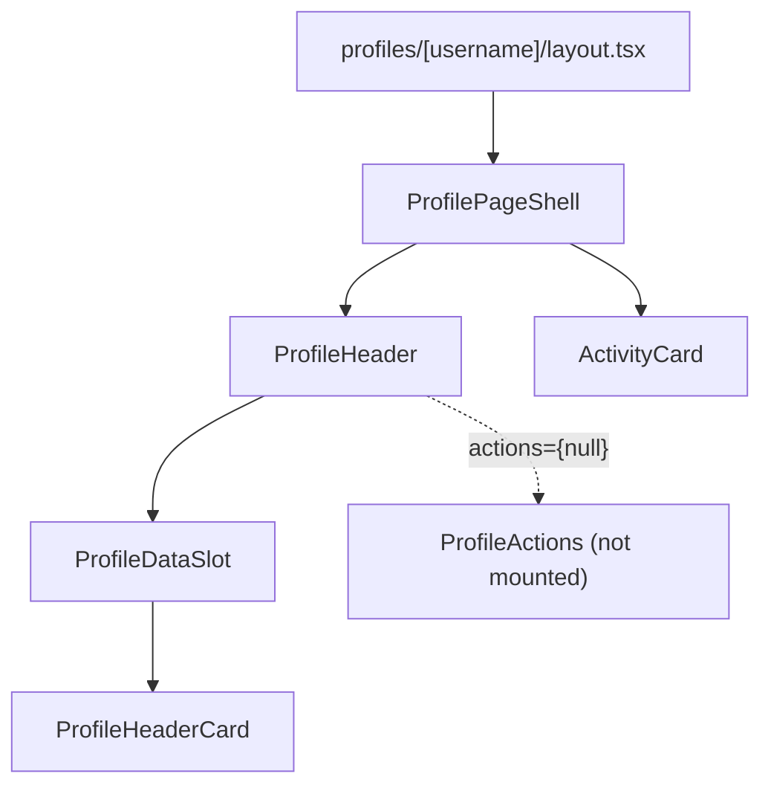
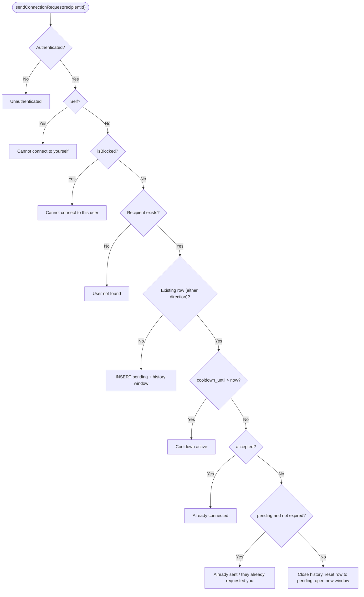

This page covers how a member is represented on Ozeaon (the `user_profiles` row, its card and hero projections, avatar and cover uploads) and the social graph between members: directed follows, bilateral connection requests with an audit history, and blocks.

:::caution[Status: follows, connections and blocking are not wired up]
The tables, server actions, API routes and RLS policies for the social graph exist, but no UI reaches them. The user profile layout passes `actions={null}` with a `TODO(post-Phase-0)` to wire `<ProfileActions />` back in ([layout.tsx](https://github.com/ozeaon/ozeaon-v2/blob/0a4f1a95824db87782f1221a4108019d174df3d9/src/app/(main)/(profile)/profiles/[username]/layout.tsx)). `ProfileActions`, `ConnectButton`, `FollowButton`, `BlockButton` and `UnblockButton` are all marked "not currently rendered", `ConnectionRequests` is imported nowhere, and nothing passes `filterFollowed` to the posts feed. "Connections & blocking: rewire into profile pages, re-enable blocking" is a **planned** roadmap item. Everything below about follows, connections and blocks describes dormant server logic.
:::

## Overview

Profiles are live: each member has a public profile page with avatar, cover image, links, role descriptor and activity counts, and an owner-facing settings editor.

The social graph models two different user-to-user relationships, and the distinction is deliberate:

| Relationship | Table | Semantics | Consent |
|--------------|-------|-----------|---------|
| Follow | `user_follows` | One-directional interest edge | None |
| Connection | `user_connections` | Mutual relationship via request and acceptance | The recipient must accept |

Accepting a connection also creates mutual follows. Every pending window of a connection request is mirrored into `user_connection_history`, and blocks live in `user_blocks`. Organization follows (`organization_follows`) are not part of this graph; see [Organization Profiles, Membership & Roles](../../organisations/organisations/).

## Architecture

All social-graph mutations are Server Actions in [`queries/profile.ts`](https://github.com/ozeaon/ozeaon-v2/blob/0a4f1a95824db87782f1221a4108019d174df3d9/src/lib/supabase/queries/profile.ts), so authentication (`getAuthUser()`), block checks and the time policy are applied on the server and client components never write to the tables directly. A parallel set of route handlers exists under [`/api/blocks`](https://github.com/ozeaon/ozeaon-v2/tree/0a4f1a95824db87782f1221a4108019d174df3d9/src/app/api/blocks), [`/api/connections`](https://github.com/ozeaon/ozeaon-v2/tree/0a4f1a95824db87782f1221a4108019d174df3d9/src/app/api/connections) and [`/api/follows`](https://github.com/ozeaon/ozeaon-v2/tree/0a4f1a95824db87782f1221a4108019d174df3d9/src/app/api/follows), and is equally uncalled from the UI.

Reads live in [`queries/profile-reads.ts`](https://github.com/ozeaon/ozeaon-v2/blob/0a4f1a95824db87782f1221a4108019d174df3d9/src/lib/supabase/queries/profile-reads.ts) and follow four conventions:

- Profiles are read through named projections (`USER_CARD_SELECT`, and `USER_GRID_CARD_SELECT` which extends it by interpolation), not `*`. The card projection embeds the `avatar_image:images!avatar_image_id(...)` join, so it can be nested in any query that joins a profile.
- Per-username reads (`getProfileIdByUsername`, `getProfileHeroDataByUsername`, `getProfileActivityCounts`) are wrapped in React `cache()`, so a page that resolves the same username in several components runs one query.
- Activity counts use `count: "exact", head: true` queries run in parallel, and the article count excludes organization-authored articles.
- Errors are logged with `logError` and the helper returns an empty result, so one failed read cannot turn a profile page into a 500.

### Profile Page Composition

`ProfilePageShell` and `ProfileHeader` are shared with organization profiles. `ProfileHeader` takes separate `dataSlot` and `actions` props; for users the actions slot is empty, while the organization layout passes its `OrganizationActions` through `OrganizationDataSlot` instead. The owner-facing editor is [`ProfileSettings`](https://github.com/ozeaon/ozeaon-v2/blob/0a4f1a95824db87782f1221a4108019d174df3d9/src/components/account/ProfileSettings.tsx), validated by [`zod/profile/profileSettings.ts`](https://github.com/ozeaon/ozeaon-v2/blob/0a4f1a95824db87782f1221a4108019d174df3d9/src/zod/profile/profileSettings.ts) against the limits in [`config/constants/profile.ts`](https://github.com/ozeaon/ozeaon-v2/blob/0a4f1a95824db87782f1221a4108019d174df3d9/src/config/constants/profile.ts). The component catalog is on [Profiles](../../components/profiles/).

## Profile Images

Avatar and cover uploads share one hook, [`use-profile-image-upload`](https://github.com/ozeaon/ozeaon-v2/blob/0a4f1a95824db87782f1221a4108019d174df3d9/src/hooks/use-profile-image-upload.ts), parameterized by `type` (`avatar` or `coverImage`). It uploads through the shared moderated upload helper to [`/api/profile/image?type=…`](https://github.com/ozeaon/ozeaon-v2/blob/0a4f1a95824db87782f1221a4108019d174df3d9/src/app/api/profile/image/route.ts) (removal is a `DELETE` to the same endpoint), so both slots get the same moderation and error mapping; see [Media & Images](../../moderation-and-storage/media-and-images/). After either operation it calls `refreshProfile()` from `useAuth()` and `router.refresh()`, so the new image shows across the session without a reload.

## Connection Request Lifecycle

*Dormant: not reachable from the UI.*

- **Cooldown first.** `cooldown_until` is stored on the row and checked before any status branch, so it overrides a more specific message. The error carries `cooldownUntil` so a UI can show when to retry. Only cancelling a request sets a cooldown; declining does not. Both windows come from [`connectionConfig.ts`](https://github.com/ozeaon/ozeaon-v2/blob/0a4f1a95824db87782f1221a4108019d174df3d9/src/config/connectionConfig.ts).
- **Direction-agnostic lookup.** One `.or(and(...),and(...))` filter finds the pair's row whichever way round it was created, which is what stops two opposing pending requests from existing.
- **Reuse, not delete.** Expired, declined and cancelled rows are reset to `pending`, and `requester_id`/`recipient_id` are reassigned to the current caller, so one physical row tracks a pair over time. Only `disconnectConnection` deletes an accepted row.
- **Atomic accept.** `acceptConnectionRequest` is a thin wrapper over the `accept_connection_request` Postgres function, which updates the status, inserts both follow edges, clears the cooldown and closes the history window in one transaction. It is passed `p_recipient_id: user.id` and re-checks inside the database that the caller is the recipient.

## Follows and Blocks

*Dormant: not reachable from the UI.*

`followUser` has no consent, expiry or history: after the auth and self-follow checks it calls `isBlocked` and rejects duplicates on the `(follower_id, following_id)` pair before inserting. Both it and `sendConnectionRequest` return vague errors ("Cannot follow this user") so a blocked user cannot tell a block from another failure.

`blockUser` calls the `block_user_with_cascade` function, which deletes follows in both directions, deletes any accepted connection, deletes the blocked user's pending request, marks the blocker's own pending request `blocked` with a cooldown, closes open history windows and then inserts the block. [`isBlocked`](https://github.com/ozeaon/ozeaon-v2/blob/0a4f1a95824db87782f1221a4108019d174df3d9/src/lib/blocks.ts) checks both directions and is used by `followUser`, `sendConnectionRequest` and [`/api/users/[userId]/stats`](https://github.com/ozeaon/ozeaon-v2/blob/0a4f1a95824db87782f1221a4108019d174df3d9/src/app/api/users/[userId]/stats/route.ts), which returns 404 for a blocked pair. Restrictive RLS policies using `private.is_blocked_pair` also hide posts, articles, comments, reactions and follows between blocked users ([`20260505150000_rls_helpers_to_private_schema.sql`](https://github.com/ozeaon/ozeaon-v2/blob/0a4f1a95824db87782f1221a4108019d174df3d9/supabase/migrations/20260505150000_rls_helpers_to_private_schema.sql)). Since no UI can create a block, none of this is triggered today.

The other dormant actions in `queries/profile.ts` are `disconnectConnection`, `unfollowUser`, `blockUser`, `unblockUser`, the list helpers `getUserFollows`/`getUserFollowers`/`getUserConnections`, and the `check*` helpers (`checkIsFollowing`, `checkIsConnected`, `checkOutgoingRequest`, `checkIncomingRequest`, `checkCooldownFollowing`). All return a `{ success, error?, data? }` envelope instead of throwing for expected failures.

## Failure Modes & Edge Cases

- **Uniqueness is in application logic.** The two-way `.or()` read-then-branch is what prevents reciprocal pending requests. Changing that filter risks duplicates.
- **Expiry is computed, not scheduled.** A request is expired when `status = 'pending'` and `expires_at < now`. No job flips expired rows; expiry only matters the next time someone sends a request.
- **Decline and cancel are not atomic.** They update the connection row and close the history window as separate statements, so a failure in between can leave an open window. History closure is keyed on `ended_at IS NULL`, so the next transition closes it.
- **Self-edges are rejected server-side.** `followUser` and `sendConnectionRequest` reject the caller's own id before touching the database, and `block_user_with_cascade` does the same.
- **Hero read uses `.single()`.** `getProfileHeroDataByUsername` returns `null` for an unknown username, and the layout turns that into a not-found page.

## Operational Notes

- The hero read resolves avatar, cover and `user_links` (ordered by `sort_order` via `referencedTable`) in one nested select.
- `getNetworkProfiles` paginates with `.range()` over `created_at` descending for the network directory.
- The two activity counts run under one `Promise.all`.

## Extension Points

- **Re-enabling the social graph:** mount `ProfileActions` in the user profile layout's `actions` slot, render `ConnectionRequests` somewhere reachable, and pass `filterFollowed` where a followed-only feed is wanted. The server side needs no change.
- **New card variant:** extend `USER_CARD_SELECT` by interpolation, as `USER_GRID_CARD_SELECT` does, instead of writing a new select string.
- **Connection time policy:** change the helpers in `connectionConfig.ts`; the insert and reuse paths both read them. The block cooldown is hard-coded in `block_user_with_cascade`.
- **New image slot:** extend the hook's `type` union and handle the new value in `/api/profile/image`.
- **New cross-table relationship operations:** follow the `accept_connection_request` and `block_user_with_cascade` precedent and implement them as Postgres functions so they stay atomic.

## Related Links

- [Media & Images](../../moderation-and-storage/media-and-images/)
- [Organization Profiles, Membership & Roles](../../organisations/organisations/)
- [Posts](../../posts/posts/)
- [Profiles components](../../components/profiles/)
- [User Settings](../../auth-and-accounts/user-settings/)
- [Data Model & Schema](../../architecture/data-model-and-schema/)
- Code: [`queries/profile.ts`](https://github.com/ozeaon/ozeaon-v2/blob/0a4f1a95824db87782f1221a4108019d174df3d9/src/lib/supabase/queries/profile.ts), [`queries/profile-reads.ts`](https://github.com/ozeaon/ozeaon-v2/blob/0a4f1a95824db87782f1221a4108019d174df3d9/src/lib/supabase/queries/profile-reads.ts), [`config/connectionConfig.ts`](https://github.com/ozeaon/ozeaon-v2/blob/0a4f1a95824db87782f1221a4108019d174df3d9/src/config/connectionConfig.ts), [`types/profiles.ts`](https://github.com/ozeaon/ozeaon-v2/blob/0a4f1a95824db87782f1221a4108019d174df3d9/src/types/profiles.ts), [`components/profiles`](https://github.com/ozeaon/ozeaon-v2/tree/0a4f1a95824db87782f1221a4108019d174df3d9/src/components/profiles)
- Migrations: [`20260622111000_add_user_profile_role_descriptor.sql`](https://github.com/ozeaon/ozeaon-v2/blob/0a4f1a95824db87782f1221a4108019d174df3d9/supabase/migrations/20260622111000_add_user_profile_role_descriptor.sql), [`20260623120000_profile_settings.sql`](https://github.com/ozeaon/ozeaon-v2/blob/0a4f1a95824db87782f1221a4108019d174df3d9/supabase/migrations/20260623120000_profile_settings.sql)
