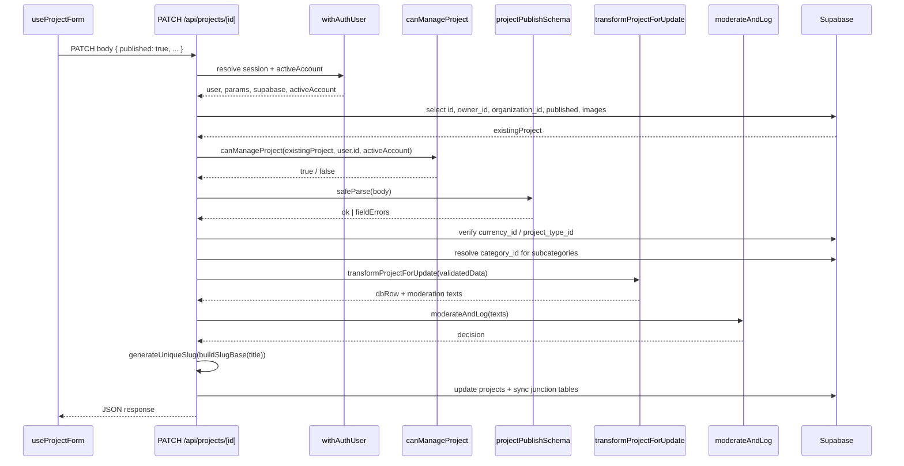
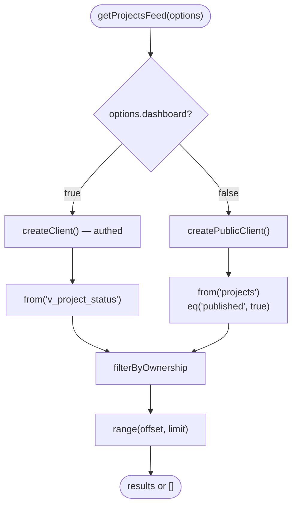
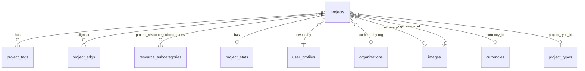

Projects are structured, publishable records with title, tagline, cover/logo imagery, SDG alignment, resource categories, tags and geographic coordinates. This page covers the write path (REST endpoints, dual Zod schemas, authorization, slug generation and moderation) and the query layer that backs project feeds and the dashboard list.

## Overview

The feature is split along a draft/published boundary:

| Concern | Draft | Published |
| --- | --- | --- |
| Schema | `projectDraftSchema` (partial, minimal validation) | `projectPublishSchema` (strict `superRefine` validations) |
| Visibility | Owner + organization members only, via RLS | Public read path (`published = true`) |
| Discovery | Dashboard feed via `v_project_status` view | Public projects feed (`/projects`, newest-first) |
| Write endpoint | `PATCH /api/projects/[id]` with `published !== true` | `PATCH /api/projects/[id]` with `published === true` |

The dual-schema design lets the editor autosave frequently (small, cheap, forgiving writes) while making publication a hard gate that cannot be satisfied by a half-filled record.

The public feed at `/projects` is a single newest-first list. The For You, Trending and New tabs are commented out in [projects/layout.tsx](https://github.com/ozeaon/ozeaon-v2/blob/0a4f1a95824db87782f1221a4108019d174df3d9/src/app/(main)/(feed)/(public)/projects/layout.tsx) pending product sign-off, and `/projects/for-you` redirects to `/projects`. The query helpers `getTrendingProjects`, `getNewProjects` and `getPublishedProjects` exist, but nothing links to their routes. A recommendation engine is on the roadmap.

Automated content moderation (`moderateAndLog`) runs on every publish. A human reporting queue is on the roadmap; the current report button links to a Google Form.

## Architecture

```mermaid
flowchart TD
    subgraph sg_Entry["Route Entry Points"]
        EditorNew["projects/new page"]
        EditorEdit["projects/[slug]/edit page"]
        FeedPage["projects feed"]
        Dashboard["settings projects page"]
        Reader["projects/[slug] reader"]
    end

    subgraph sg_API["API Layer (src/app/api/projects)"]
        ApiId["/api/projects/[id] route.ts"]
        ApiImage["/api/projects/[id]/image"]
        ApiDocs["/api/projects/[id]/documents"]
        ApiComments["/api/projects/[id]/comments"]
    end

    subgraph sg_Logic["Domain Logic"]
        FormHook["useProjectForm hook"]
        ZodDraft["projectDraftSchema"]
        ZodPublish["projectPublishSchema"]
        Slug["buildSlugBase / generateUniqueSlug"]
        Z2D["transformProjectForUpdate"]
        Moderation["moderateAndLog"]
        Authz["canManageProject"]
    end

    subgraph sg_Data["Data Access"]
        Queries["lib/supabase/queries/projects.ts"]
        PublicClient["createPublicClient"]
        AuthClient["createClient (authed)"]
    end

    subgraph sg_DB["Supabase"]
        Projects[("projects")]
        Stats[("project_stats")]
        StatusView[("v_project_status")]
        Joins[("project_tags / project_sdgs")]
    end

    EditorNew --> FormHook
    EditorEdit --> FormHook
    FormHook --> ZodPublish
    FormHook --> ZodDraft
    FormHook --> ApiId
    ApiId --> ZodPublish
    ApiId --> ZodDraft
    ApiId --> Authz
    ApiId --> Slug
    ApiId --> Z2D
    ApiId --> Moderation
    ApiId --> Projects
    FeedPage --> Queries
    Dashboard --> Queries
    Reader --> Queries
    Queries --> PublicClient
    Queries --> AuthClient
    PublicClient --> Projects
    PublicClient --> Stats
    AuthClient --> StatusView
    Queries --> Joins
```



API routes own validation and authorization. The query module owns shape and filtering of read models. `useProjectForm` owns client-side form state and step gating. Keeping slug generation and moderation in the API layer means a direct API caller gets the same guarantees as the UI.

## Lifecycle: From Draft to Published

The PATCH handler in [`src/app/api/projects/[id]/route.ts`](https://github.com/ozeaon/ozeaon-v2/blob/0a4f1a95824db87782f1221a4108019d174df3d9/src/app/api/projects/[id]/route.ts) is the single write path. It runs in a strict sequence:

1. **Existence check** — select the columns needed for authorization and image cleanup; return 404 on missing.
2. **Authorization** — `canManageProject(supabase, existingProject, user.id, activeAccount)` using the already-fetched row to avoid a second round trip. Return 403 on failure.
3. **Schema selection** — `body.published === true` promotes the request to `projectPublishSchema`; otherwise `projectDraftSchema`. Invalid payloads return 400 with a field-keyed error map (`result.error.flatten().fieldErrors`) that `react-hook-form` can surface inline.
4. **Referential checks** — `currency_id` and `project_type_id` are looked up against their tables. Free-form IDs from the client are not trusted to reference real rows.
5. **Subcategory → category resolution** — the client sends subcategory IDs; the handler resolves the parent `category_id` for each. Category alignment is derived, not trusted.
6. **Zod → DB transformation + moderation** — `transformProjectForUpdate` maps validated data to the database shape; `collectProjectModerationTexts` derives the strings passed to `moderateAndLog`. What is moderated is what will be stored. The handler returns 422 on rejection, 503 on a moderation service error (fail-closed).
7. **Slug generation** — `buildSlugBase(title)` (pure, synchronous) then `generateUniqueSlug` (async, queries for collisions). Slug generation happens after validation so the slug always reflects the validated title.

The "Enable Funding" and "Accept Donations" toggles in `ConfigurationSection` are `disabled` and labelled "Coming soon". Project funding, tipping and payments are on the roadmap.

## Core Flow



Authorization happens before parsing the body so an unauthorized caller cannot probe the validation schema. Schema selection happens before referential checks so only structurally valid payloads trigger further database reads.

## Discovery: Read Paths

All discovery helpers live in [`src/lib/supabase/queries/projects.ts`](https://github.com/ozeaon/ozeaon-v2/blob/0a4f1a95824db87782f1221a4108019d174df3d9/src/lib/supabase/queries/projects.ts).

### Filter Resolution

When both subcategory and SDG filters are present, `resolveFilterIds` builds a `Set` per filter and intersects them — a project must match all active filters. The `null` return is semantically distinct from `[]`: `null` means no filter applied; `[]` means filter applied, nothing matched. Every caller short-circuits on the empty case before issuing the projects query:

```typescript
const filteredIds = await resolveFilterIds(supabase, filters);
if (filteredIds !== null && !filteredIds.length) return [];
```

### Feed Functions

- **`getPublishedProjects`** — the default public feed, newest-first, filtered to `published = true`. Accepts subcategory, SDG, project type and date range filters. Date `to` is appended with `T23:59:59Z` so a project ending on the selected day is not excluded (end_date is a date, not a timestamp).
- **`getTrendingProjects`** — orders by the precomputed `engagement_score` on `project_stats`, capped at 20 rows. Ranking is an index-ordered scan, not a runtime aggregate.
- **`getNewProjects`** — projects created since UTC midnight today (truncated to `T00:00:00Z` to normalize to a UTC day boundary), capped at 20.
- **`getLatestProjects`** — a lightweight fixed-size list (default 4) using a narrower `LATEST_PROJECTS_SELECT` that embeds cover image, author, authoring organization and subcategories in one request. Returns `FeaturedProject[]` and logs errors with context because this feeds a high-visibility slot.

The trending, new and latest feeds exist but nothing in the UI currently links to them — see the note above about commented-out tabs.

### `getProjectsFeed` — The Dual-Mode Feed

`getProjectsFeed` is overloaded on `dashboard: true` to select different return types and clients:

- **Dashboard branch** — uses the authenticated `createClient()` and reads from `v_project_status`, which carries a server-computed status column alongside project columns. This lets the dashboard filter by status with a single `.eq("status", statusFilter)` predicate. The status is re-nested at the boundary (`{ status, ...rest } → { ...rest, project_status: { status } }`) so the view shape does not leak into component props.
- **Public branch** — uses `createPublicClient()` and hard-filters to `published = true`. Visibility is enforced in two independent places: the explicit `.eq("published", true)` predicate and the anonymous client's lack of a session.



### Ownership Filtering

A project belongs to a user or an organization, never both. `filterByOwnership` OR-s the two conditions when both id lists are non-empty — AND-ing them matches nothing:

```typescript
return query.or(
  `owner_id.in.(${userIds.join(",")}),organization_id.in.(${organizationIds.join(",")})`,
);
```

The combined branch interpolates IDs directly into a raw PostgREST `or(...)` expression. An arbitrary string there would be parsed as filter grammar rather than a value, so both lists must be UUIDs before reaching this function. Request-supplied IDs are validated by `ownershipParamsSchema` in `/api/projects` before they arrive.

## Data Model



`GET /api/projects/[id]` selects the parent row with embedded junction tables and flattens `resource_subcategories`, `sdgs` and `project_tags` into plain ID/string arrays. This makes GET and PATCH symmetric: what GET returns is directly parseable by `projectDraftSchema`/`projectPublishSchema` as an edit payload.

The `v_project_status` view computes draft-vs-published status server-side so the dashboard can filter by status with a single indexed predicate and so the same status value is consistent across every client.

## Failure Modes & Edge Cases

- **Null vs. `[]` from `resolveFilterIds`** — callers must distinguish "no filter" from "filter returned nothing". Every caller checks `filteredIds !== null && !filteredIds.length` before issuing the projects query.
- **Ownership OR requirement** — AND-ing owner and organization filters matches nothing because ownership is exclusive. Both conditions must be OR'd.
- **UUID precondition in `filterByOwnership`** — IDs interpolated into the raw PostgREST `or(...)` expression are parsed as filter grammar if they are not valid UUIDs. The `/api/projects` route validates request-supplied IDs via `ownershipParamsSchema` before they reach the function.
- **Date-suffix gotcha** — `end_date` is a date, not a timestamp. Filtering with `lte` without appending `T23:59:59Z` excludes projects ending on the selected day.
- **Moderation fail-closed** — a `ModerationError` returns 503 rather than proceeding with persistence.

## Extension Points

- **New project type** — add a row to `project_types`; the form maps them generically via `InputRadioTiles`.
- **New feed tab** — add a query helper in `queries/projects.ts`, a route under `(feed)/(public)/projects/`, and re-enable the commented-out tab in `projects/layout.tsx`.
- **Status filtering on the dashboard** — the `v_project_status` view centralizes the status computation; adding a new status means extending the view definition.
- **Funding / donations** — the `funding_enabled` and `donations_enabled` fields exist in the schema and the form but their toggles are disabled; enabling them requires wiring the payment provider.

## Related Links

- [PATCH route](https://github.com/ozeaon/ozeaon-v2/blob/0a4f1a95824db87782f1221a4108019d174df3d9/src/app/api/projects/[id]/route.ts)
- [Query helpers](https://github.com/ozeaon/ozeaon-v2/blob/0a4f1a95824db87782f1221a4108019d174df3d9/src/lib/supabase/queries/projects.ts)
- [Zod schemas](https://github.com/ozeaon/ozeaon-v2/blob/0a4f1a95824db87782f1221a4108019d174df3d9/src/zod/projects/index.ts)
- [useProjectForm hook](https://github.com/ozeaon/ozeaon-v2/blob/0a4f1a95824db87782f1221a4108019d174df3d9/src/hooks/use-project-form.ts)
- [Projects feed layout](https://github.com/ozeaon/ozeaon-v2/blob/0a4f1a95824db87782f1221a4108019d174df3d9/src/app/(main)/(feed)/(public)/projects/layout.tsx)
- [Project components](../../components/projects/)
- [Moderation](../../moderation-and-storage/moderation/)
